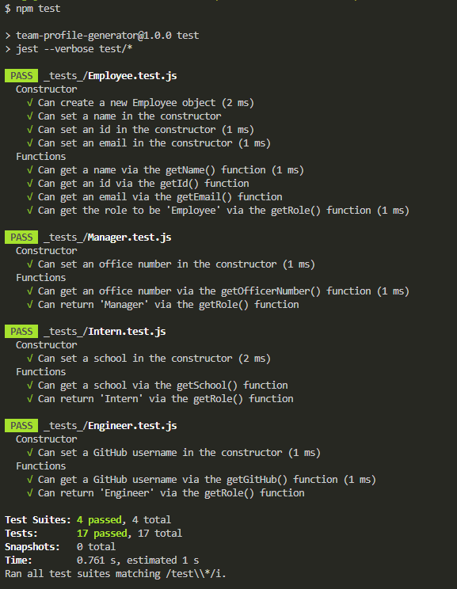
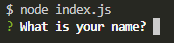
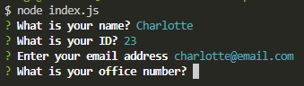
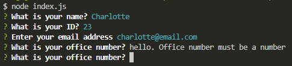
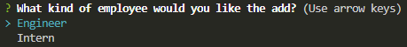
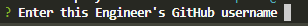
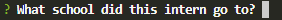
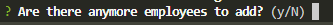

# Team-profile-generator


## Description

This project generates a HTML file to display a team profile through Node.js after a user answers a number of prompts in the command-line.

When a user invokes the command `node index.js` in the command-line, the user is provided a number of prompts to answer, including input, list and confirm types of prompts. These prompts include validation to ensure an answer is provided and is done so in the correct way.

Once the user confirms they have no more employee's to add, a HTML page is generated using the data that has been inputted by the user.

## Table of contents

- [User Story](#user-story)
- [Acceptance criteria](#acceptance-criteria)
- [Technologies user/built with](#technologies-usedbuilt-with)
- [Installation](#installation)
- [Usage](#usage)
- [Tests](#tests)
- [Credits](#credits)
- [License](#license)

## User story

```
AS A manager
I WANT to generate a webpage that displays my team's basic info
SO THAT I have quick access to their emails and GitHub profiles
```

## Acceptance criteria

```
GIVEN a command-line application that accepts user input
WHEN I am prompted for my team members and their information
THEN an HTML file is generated that displays a nicely formatted team roster based on user input
WHEN I click on an email address in the HTML
THEN my default email program opens and populates the TO field of the email with the address
WHEN I click on the GitHub username
THEN that GitHub profile opens in a new tab
WHEN I start the application
THEN I am prompted to enter the team manager’s name, employee ID, email address, and office number
WHEN I enter the team manager’s name, employee ID, email address, and office number
THEN I am presented with a menu with the option to add an engineer or an intern or to finish building my team
WHEN I select the engineer option
THEN I am prompted to enter the engineer’s name, ID, email, and GitHub username, and I am taken back to the menu
WHEN I select the intern option
THEN I am prompted to enter the intern’s name, ID, email, and school, and I am taken back to the menu
WHEN I decide to finish building my team
THEN I exit the application, and the HTML is generated
```

## Technologies used/built with

This project used the following technologies to build and test it:
- Node.js
- JavaScript
- Inquirer NPM package
- Jest NPM package
- `fs` for file creation
- [Bootstrap](https://getbootstrap.com/) for styling
- [Bootstrap icons](https://icons.getbootstrap.com/) for icons
- [Google Fonts](https://fonts.google.com/)

## Installation

1. Clone the repo (HTTPS: `git clone https://github.com/CharDige/Team-profile-generator.git` or SSH: `git clone git@github.com:CharDige/Team-profile-generator.git`)

2. Install inquirer NPM package (`npm install inquirer`)

3. Install jest NPM package to run tests (`npm install jest`)

## Usage

Below, you will find a walkthrough video and screenshots on how to test and use this application. To see the results, view the [index.html file](./dist/index.html) in the `/dist` folder.

### Video

To view how this team profile generator works, how it can be used, as well as the generator passing several tests, you can watch [this walkthrough video](https://drive.google.com/file/d/1dsBWmOtbjTIGU-MFoN5u4UDHjCfUvxit/view?usp=sharing).

### Screenshots

After the installation process has been undertaken, you may want to run the tests first. If so, enter `npm test` in the command-line, which will run several tests that are located in the `/_tests_` folder.



Once you've tested the application, you can initiative the prompts by entering `node index.js` into the command-line.

You will be given your first question, which is to provide your name. Once you've done this, you'll proceed to answer further prompts, such as what your ID is (must be a number), your email and your office number (must be a number).





Where prompts ask for details, such as an ID or email address, there are validations in place which will prevent the user from inputting incorrect information.



Once the user has answered the first round of prompts, they will be asked if they want to add an Engineer or Intern as an employee.



When the user asks for either, they will be presented with similar questions as before. The difference is that there will be a prompt asking for a GitHub username for engineers or the school the intern attended, rather than asking for an office number.





When the user finishes answering the prompts for either an engineer or intern, they will be asked if they wish to add another employee or not. If they do, they can enter `y` into the command-line and will then be prompted to ask if they wish to add an engineer or intern again. If they don't, they can enter `n` into the command-line, which will finish the prompts and generate a HTML file.



And there you have it, team profiles have been generated into a HTML file that is responsive and usable.

## Tests

A number of tests are available for this web application. If you would like to run these tests:

1. Follow the installation instructions in the [installation](#installation) portion of this README.md, ensuring you install the jest npm package as this will run the tests (enter into the command-line `npm install jest`)

2. Enter into the command-line `npm test`.

## Credits

Here's a list of resources I'd like to credit that really helped with the creation of this application:

- [Amitabh-K - validate-email-inquirer.prompt](https://gist.github.com/Amitabh-K/ae073eea3d5207efaddffde19b1618e8)
- [Inquirer.js - npm.js](https://www.npmjs.com/package//inquirer)
- [W3 Schools - CSS Shadow Effects](https://www.w3schools.com/css/css3_shadows.asp)
- [Stack Overflow - Conditional Prompt rendering in inquirer?](https://stackoverflow.com/questions/56412516/conditional-prompt-rendering-in-inquirer)
- [W3 Schools - JavaScript Array filter()](https://www.w3schools.com/jsref/jsref_filter.asp)
- [W3 Schools - JavaScript Array map()](https://www.w3schools.com/jsref/jsref_map.asp)
- [W3 Schools - JavaScript Array join()](https://www.w3schools.com/jsref/jsref_join.asp)
- [mdn web docs - Array.prototype.map()](https://developer.mozilla.org/en-US/docs/Web/JavaScript/Reference/Global_Objects/Array/map)
- [Stackify - Node.js Module Exports - Demystified](https://stackify.com/node-js-module-exports/)
- [bobbyhadz blog - Remove all commas from a String in JavaScript](https://bobbyhadz.com/blog/javascript-remove-all-commas-from-string)
- [sitepoint - Understanding module.exports and exports in Node.js](https://www.sitepoint.com/understanding-module-exports-exports-node-js/)
- [Stack Overflow - How to clear wrong input in Inquirer.js](https://stackoverflow.com/questions/62798907/how-to-clear-wrong-input-in-inquirer-js)

## License

[MIT License - Copyright (C) 2022 Charlotte Dige](./LICENSE)